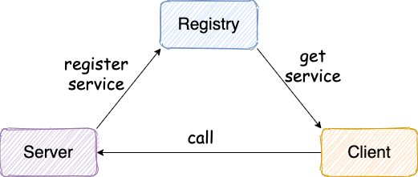

# RPC架构

**一般情况下， RPC 框架不仅要提供服务发现功能，还要提供负载均衡、容错等功能，这样的 RPC 框架才算真正合格的。**

**简单说一下设计一个最基本的 RPC 框架的思路：**

### 1. **注册中心** ：

    - 注册中心首先是要有的，推荐使用 Zookeeper。注册中心负责服务地址的注册与查找，相当于目录服务。服务端启动的时候将服务名称及其对应的地址(ip+port)注册到注册中心，服务消费端根据服务名称找到对应的服务地址。有了服务地址之后，服务消费端就可以通过网络请求服务端了。

    - ZooKeeper 为我们提供了高可用、高性能、稳定的分布式数据一致性解决方案，通常被用于实现诸如数据发布/订阅、负载均衡、命名服务、分布式协调/通知、集群管理、Master 选举、分布式锁和分布式队列等功能。并且，ZooKeeper 将数据保存在内存中，性能是非常棒的。 在“读”多于“写”的应用程序中尤其地高性能，因为“写”会导致所有的服务器间同步状态。（“读”多于“写”是协调服务的典型场景）。

### 2. **网络传输** ：

    - 既然要调用远程的方法就要发请求，请求中至少要包含你调用的类名、方法名以及相关参数吧！推荐基于 NIO 的 Netty 框架。

    - 网络传输具体实现可以使用 Socket 、NIO、Netty：

    - Socket：Java 中最原始、最基础的网络通信方式。但是Socket 是阻塞 IO、性能低并且功能单一
    NIO：同步非阻塞的 I/O 模型，但是用它来进行网络编程真的太麻烦了
    Netty：基于 NIO 的 client-server(客户端服务器)框架，使用它可以快速简单地开发网络应用程序。极大地简化并简化了 TCP 和 UDP 套接字服务器等网络编程, 并且性能以及安全性等很多方面甚至都要更好。支持多种协议如 FTP，SMTP，HTTP 以及各种二进制和基于文本的传统协议。

### 3. **序列化** ：
    - 既然涉及到网络传输就一定涉及到序列化，你不可能直接使用 JDK 自带的序列化吧！JDK 自带的序列化效率低并且有安全漏洞。 所以，你还要考虑使用哪种序列化协议，比较常用的有 hession2、kyro、protostuff。

    - 因为网络传输的数据必须是二进制的。因此，我们的 Java 对象没办法直接在网络中传输。为了能够让 Java 对象在网络中传输我们需要将其序列化为二进制的数据。我们最终需要的还是目标 Java 对象，因此我们还要将二进制的数据 “解析” 为目标 Java 对象，也就是对二进制数据再进行一次反序列化。

    - 另外，不仅网络传输的时候需要用到序列化和反序列化，将对象存储到文件、数据库等场景都需要用到序列化和反序列化。JDK 自带的序列化，只需实现 java.io.Serializable接口即可，不过这种方式不推荐，因为不支持跨语言调用并且性能比较差。

### 4. **动态代理** ： 
另外，动态代理也是需要的。因为 RPC 的主要目的就是让我们调用远程方法像调用本地方法一样简单，使用动态代理可以屏蔽远程方法调用的细节比如网络传输。也就是说当你调用远程方法的时候，实际会通过代理对象来传输网络请求，不然的话，怎么可能直接就调用到远程方法呢？

- 我们知道代理模式就是： 我们给某一个对象提供一个代理对象，并由代理对象来代替真实对象做一些事情。你可以把代理对象理解为一个幕后的工具人。 举个例子：我们真实对象调用方法的时候，我们可以通过代理对象去做一些事情比如安全校验、日志打印等等。但是，这个过程是完全对真实对象屏蔽的。

讲完了代理模式，再来说动态代理在 RPC 框架中的作用。

RPC 的主要目的就是让我们调用远程方法像调用本地方法一样简单，我们不需要关心远程方法调用的细节比如网络传输。

怎样才能屏蔽程方法调用的底层细节呢？答案就是动态代理

动态代理机制包括 JDK 动态代理、CGLIB 动态代理、Javassist 动态代理等

### 5. **负载均衡** ：
负载均衡也是需要的。为啥？举个例子我们的系统中的某个服务的访问量特别大，我们将这个服务部署在了多台服务器上，当客户端发起请求的时候，多台服务器都可以处理这个请求。那么，如何正确选择处理该请求的服务器就很关键。假如，你就要一台服务器来处理该服务的请求，那该服务部署在多台服务器的意义就不复存在了。负载均衡就是为了避免单个服务器响应同一请求，容易造成服务器宕机、崩溃等问题，我们从负载均衡的这四个字就能明显感受到它的意义。

当我们的系统中的某个服务的访问量特别大的时候，假设我们将这个服务部署在了多台服务器上，当客户端发起请求的时候，多台服务器都可以处理这个请求。那么，如何正确选择处理该请求的服务器就很关键。

负载均衡就是为了避免单个服务器响应同一请求，容易造成服务器宕机、崩溃等问题。

### 6. 传输/通信协议
我们还需要设计一个私有的 RPC 协议（通信/传输协议），这个协议是客户端（服务消费方）和服务端（服务提供方）交流的基础。

简单来说：通过设计传输协议，我们定义需要传输哪些类型的数据， 并且还会规定每一种类型的数据应该占多少字节。这样我们在接收到二级制数据之后，就可以正确的解析出我们需要的数据。

通常一些标准的 RPC 协议包含下面这些内容：

- 魔数 ： 通常是 4 个字节。这个魔数主要是为了筛选来到服务端的数据包，有了这个魔数之后，服务端首先取出前面四个字节进行比对，能够在第一时间识别出这个数据包并非是遵循自定义协议的，也就是无效数据包，为了安全考虑可以直接关闭连接以节省资源。
- 序列化器编号 ：标识序列化的方式，比如是使用 Java 自带的序列化，还是 json，kyro 等序列化方式。
- 消息体长度 ： 运行时计算出来。
- ..........

### 如果我要自己写的话，需要提前了解哪些知识

**Java** ：

1. 动态代理机制；
2. 序列化机制以及各种序列化框架的对比，比如 hession2、kyro、protostuff。
3. 线程池的使用；
4. `CompletableFuture` 的使用
5. ......

**Netty** ：

1. 使用 Netty 进行网络传输；
2. `ByteBuf` 介绍
3. Netty 粘包拆包
4. Netty 长连接和心跳机制

**Zookeeper** :

1. 基本概念；
2. 数据结构；
3. 如何使用 Netflix 公司开源的 zookeeper 客户端框架 Curator 进行增删改查；

### 零零散散

- Java SPI 
    java.util.ServiceLoader
    SPI全称Service Provider Interface，是Java提供的一套用来被第三方实现或者扩展的API，它可以用来启用框架扩展和替换组件。

    Java SPI 实际上是“基于接口的编程＋策略模式＋配置文件”组合实现的动态加载机制，提供了通过interface寻找implement的方法。类似于IOC的思想，将装配的控制权移到程序之外，从而实现解耦。

- @Component 注解
    作用对象不同：@Component 注解作用于类，而 @Bean 注解作用于方法、
    
    @Component 通常是通过路径扫描来自动侦测以及自动装配到 Spring 容器中(我们可以使用 @ComponentScan 注解定义要扫描的路径从中找出标识了需要装配的类自动装配到 Spring 的 bean 容器中)。@Bean 注解通常是我们在标有该注解的方法中定义产生这个 bean，@Bean 告诉了 Spring 这是某个类的实例，当我们需要用它的时候还给我。
    
    @Bean 注解比 @Component 注解的自定义性更强，而且很多地方我们只能通过 @Bean 注解来注册 bean。比如当我们引用第三方库中的类需要装配到 Spring 容器时，只能通过 @Bean 来实现。